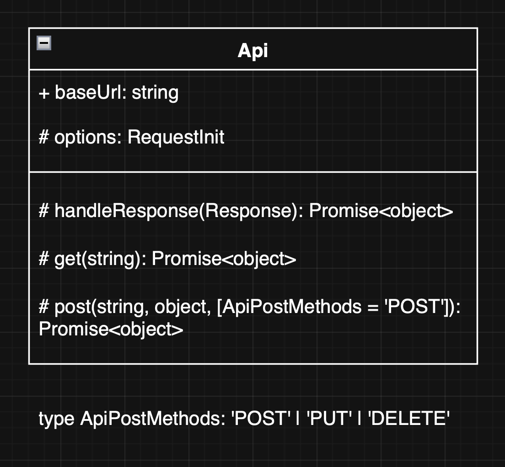
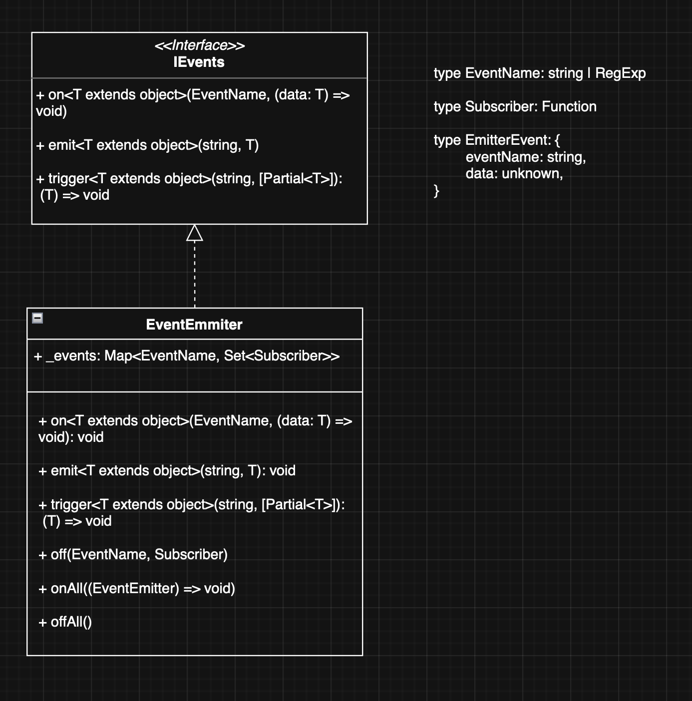

# Проектная работа "Веб-ларек"

Стек: HTML, SCSS, TS, Webpack

Проект представляет собой MVP паттерн

Структура проекта:
- src/ — исходные файлы проекта
- src/components/ — папка с JS компонентами
- src/components/base/ — папка с базовым кодом

Важные файлы:
- src/pages/index.html — HTML-файл главной страницы
- src/types/index.ts — файл с типами
- src/index.ts — точка входа приложения
- src/scss/styles.scss — корневой файл стилей
- src/utils/constants.ts — файл с константами
- src/utils/utils.ts — файл с утилитами

## Установка и запуск
Для установки и запуска проекта необходимо выполнить команды

```
npm install
npm run start
```

или

```
yarn
yarn start
```
## Сборка

```
npm run build
```

или

```
yarn build
```

## Базовые классы

Класс ```Api``` основной класс для осуществления запросов к бэкенду. Реализованы get и post методы.
При инициализации в конструктор принимает обязательный параметр baseUrl и необязательный options с полем headers



Класс ```EventEmitter``` классическая реализация брокера событий. Его функции: возможность установить и снять слушателей событий, вызвать слушателей при возникновении события.



Абстрактный класс ```View``` базовый класс, от которого будут наследоваться все представления

Поля класса:

container: HTMLElement - контейнер в котором будет рендерится view
settings: T - настройки для рендеринга

Конструктор:

constructor(container: HTMLElement, settings: T): принимает в себя контейнер внутри которого будет происходить рендер и настройки

Методы класса:

render(): void рендерит представление внутри контейнера

## Логические элементы

### Header

Отображает лого и компонент корзины

### Кнопка Корзина

Имеет бейдж с количеством товаров добавленных в корзину, по клику на корзину открывается модальное окно

### Список товаров

Компонент, который содержит в себе карточки товаров и отвечает за их отображение

### Карточка товара

Содержит в себе:
- Бейдж категории к которой относится товар
- Название товара
- Изображение товара
- Стоимость товара

По клику на карточку товара открывается модальное окно с подробным описанием товара

### Модальное окно

Все модальные окна имеют схожий общий вид

- Подложку затененную
- Само модальное окно
- Кнопку закрытия модального окна

Далее описаны детали каждого отдельного модального окна


### Модальное окно описания товара

Содержит в себе:

- Бейдж категории
- Изображение товара
- Название товара
- Описание
- Кнопка "В корзину"
- Стоимость товара

### Модальное окно корзины

Модальное окно корзины разбито на 4 шага:

#### 1 шаг Корзина

- Список товаров
- Кнопка "Оформить"
- Общая стоимость товаров

Элемент товара состоит из следующих элементов:

- Номер по порядку
- Название товара
- Кнопка удаления товара из корзины

#### 2 шаг

- Выбор способа оплаты
- Инпут ввода адреса доставки
- Кнопка "Далее" (активна при заполненных даных)

#### 3 шаг

- Инпут ввода Email
- Инпут ввода телефона
- Кнопка "Оплатить" (активна при заполненных даных)

#### 4 шаг

Экран успешной оплаты товара

- Иконка успешной оплаты
- Уведомление о списанной сумме
- Кнопка "За новыми покупками!"

## Модели

### Product

Product модель хранит в себе данные продукта

```
interface Product {
  id: string;
  title: string;
  description: string;
  image: string;
  category: string;
  price: number | null;
  formatPrice: () => string;
}
```

### ProductList

Модель хранит в себе список продуктов

```
interface ProductList {
  items: Product[];
}
```

Класс ProductListModel наследует интерфейс ProductList

Конструктор:

constructor(items: Product[]) - конструктор принимает массив объектов Product

Поля класса:

items: Product[] - элементы списка продуктов

Методы класса:

set items(data: Product[]) - при установке поля конвертируем к нужному классу

### UserData

Модель хранит в себе данные пользователя

```
interface UserData {
  email: string;
  phone: string;
  address: string;
}
```

Класс UserDataModel наследует интерфейс UserData

Конструктор:

constructor(userData: UserData) - конструктор принимает объект типа UserData

Поля класса:

email: string - почта пользователя
phone: string - номер телефона
address: string - адресс

Методы класса:

set email(email) - принимает почту и валидирует, в случае несоответсвия шаблону выкидывает ошибку
set phone(phone) - принимает номер телефона и валидирует, в случае несоответсвия шаблону выкидывает ошибку
set address(address) - принимает адресс и валидирует, в случае несоответсвия шаблону выкидывает ошибку

### Order

Модель хранит в себе данные пользователя и заказа

```
export interface Order extends UserData {
  payment: "online" | "offline";
  total: number;
  items: Pick<Product, 'id'>[]
}
```

Класс OrderModel наследует интерфейс Order

Конструктор:

constructor(order: Order) - конструктор принимает объект типа Order

Поля класса:

email: string - почта пользователя
phone: string - номер телефона
address: string - адресс
payment: "online" | "offline" - тип платежа
total: number - общая стоимость заказа
items: Pick<Product, 'id'>[] - массив id продуктов

Методы класса:

set email(email) - принимает почту и валидирует, в случае несоответсвия шаблону вызывает событие ошибки
set phone(phone) - принимает номер телефона и валидирует, в случае несоответсвия шаблону вызывает событие ошибки
set address(address) - принимает адресс и валидирует, в случае несоответсвия шаблону вызывает событие ошибки
set payment("online" | "offline") - принимает два типа заказа
set total(totalPrice: number) - принимает сумму заказа
set items(prodictsId: Pick<Product, 'id'>[]) - принимает массив айди продуктов

### ApiOrder

Модель зранит в себе данные о заказе

```
interface ApiOrder {
  id: string;
  total: number;
}
```

Класс ApiOrderModel наследует интерфейс ApiOrder

Конструктор:

constructor(id: string, total: number) - конструктор принимает id заказа и общую сумму

Поля класса:

id: string - id заказа
total: number - общая сумма заказа

Методы класса:

set id(id) - принимает и устанавливает id заказа
set total(total) - принимает и устанавливает общую сумму заказа

## Представления

### BasketButton

Представление необходимое для отображения корзины товаров и бейджа общей стоимостью наследуется от абстрактного класса ```View```

Конструктор тот же что и у базового класса

Методы:

render(totalSum: number): принимает стоимость всех товаров в корзине для отображения на бейдже

onClick(): void - вызывает событие для отображения модального окна корзины

### ProductListView

Представление необходимое для отображения списка товаров наследуется от абстрактного класса ```View```

Конструктор тот же что и у базового класса

Методы: 

render(items: Product[]): void - пробегает по списку продуктов и для каждого вызывает рендер, также навешивает на весь список слушателя событий 'click'

renderProduct(): void - отображает карточку товара

### ModalView

Представление для отображения модального окна наследуется от абстрактного класса ```View```

Конструктор тот же что и у базового класса

Методы класса:

show(): void - отображает модальное окно

hide(): void - скрывает модальное окно

setContent(element: HTMLElement): void - принимает контент и отображает его внутри модального окна


### ProductView

Представление для отображения подробного описания товара наследуется от абстрактного класса ```View```

Конструктор тот же что и у базового класса

Методы:

render(product: Product): void - рендерит данные продукта, навешивает событие click на кнопку "Купить"

set data(product: ProductData) - устанавливает поля класса для отображения

### CardBasket

Представление необходимое для отображения товара в корзине наследуется от абстрактного класса ```View```

Конструктор тот же что и у базового класса

Методы: 

render(product: Product): void - рендерит продукт внутри коризны, его назвнаие и стоимость

remove(): void - вызывает событие для удаления товара из списка внутри модели корзины

### BasketView

Представление для отображения корзины наследуется от абстрактного класса ```View```

Конструктор тот же что и у базового класса

Методы:

render(items: Product[]): void - рендерит данные о продуктах, добавленных в корзину, навешивает событие click на кнопку "Оформить", а также на список товаров, для отслеживания удаления элемента из корзины

### OrderFormView

Представление для отображения формы оплаты наследуется от абстрактного класса ```View```

Конструктор тот же что и у базового класса

Методы:

setErrorAdress(error: string): void - отображает ошибку поля ввода адреса

disableNext(): void - отключает кнопку далее

enableNext(): void - включает кнопку далее

### ContactsFormView

Представление для отображения формы ввода данных наследуется от абстрактного класса ```View```

Конструктор тот же что и у базового класса

Методы:

setErrorEmail(error: string): void - отображает ошибку поля ввода email

setErrorPhone(error: string): void -  отображает ошибку поля ввода телефона

### SuccessView

Представление для отображения успешного заказа наследуется от абстрактного класса ```View```

Конструктор тот же что и у базового класса

Методы:

render(total: number): void - принимает общую стоимость выполненного заказа и отображает экран успешного заказа

## Presentor

Является по сути своей менеджером состояния приложения. Управление состоянием приложения осуществляется через брокер сообщений. События могут возникать как 
через представлеия, через действия пользователя так и программно. Эти события сообщают моделям как необходимо измениться, и уже измененные модели через Presentor
попадают в представления
